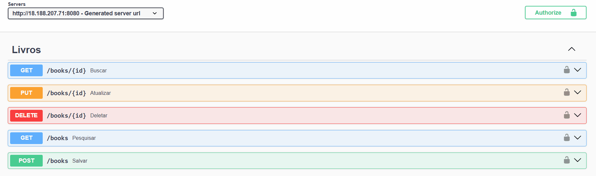
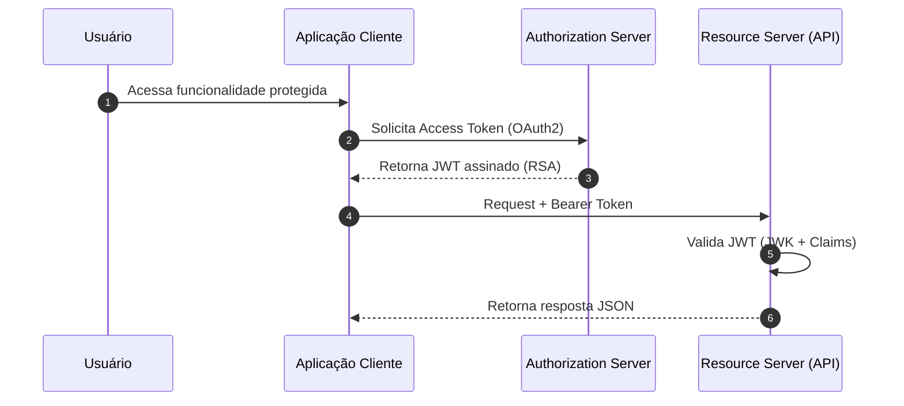

# 📚 Library API


API RESTful completa para gerenciamento de uma livraria, desenvolvida como parte de um estudo aprofundado sobre o ecossistema **Spring Boot**.

O projeto segue rigorosas boas práticas de engenharia de software, apresentando uma arquitetura em camadas, **segurança robusta com OAuth2**, validação de dados, integridade referencial e tratamento global de exceções.

---

## 📑 Índice

- [🎬 Demonstração](#-demonstração)
- [🚀 Tecnologias Utilizadas](#-tecnologias-utilizadas)
- [⚙️ Arquitetura e Segurança](#️-arquitetura-e-segurança)
  - [Authorization Server](#-authorization-server)
  - [Controle de Acesso (RBAC)](#️-controle-de-acesso)
  - [Deploy em Produção (AWS)](#️-deploy-em-produção-aws)
- [🐳 Docker](#-docker)
- [🔐 Fluxo de Autenticação OAuth2](#-fluxo-de-autenticação-oauth2)
- [🔌 Endpoints (API Reference)](#-endpoints-api-reference)
- [🚨 Tratamento Global de Exceções](#-tratamento-global-de-exceções)
- [🗂️ Estrutura de Pastas do Projeto](#️-estrutura-de-pastas-do-projeto)
- [🔍 Observabilidade e Monitoramento](#-observabilidade-e-monitoramento)
- [🖥️ Como Rodar o Projeto Localmente](#️-como-rodar-o-projeto-localmente-sem-docker)
- [🔧 Variáveis de Ambiente](#-variáveis-de-ambiente)
- [📌 Status do Projeto](#-status-do-projeto)
- [👨‍💻 Autor](#-autor)


---

## 🎬 Demonstração



> Demonstração do fluxo de autenticação e consumo da API via Swagger UI

---

## 🚀 Tecnologias Utilizadas
- **Java 21**
- **Spring Boot 3**
- **Spring Authorization Server** (Emissão de Tokens, JWK Source, OIDC)
- **Spring Security** (Resource Server e Filtros Customizados)
- **OAuth2 Client** (Login Social com Google)
- **Spring Data JPA** (Persistência)
- **PostgreSQL** (Banco de dados)
- **SpringDoc OpenAPI / Swagger UI** (Documentação Dinâmica)
- **Spring Boot Actuator** (Métricas e Saúde da Aplicação)
- **MapStruct** (Mapeamento DTO ↔ Entidade)
- **Lombok** (Boilerplate reduction)
- **Bean Validation** (Validação de dados)
- **Maven** (Gerenciamento de dependências)
- **Docker** (Containerização)
- **AWS** (Deploy - EC2 e RDS)


---

## ⚙️ Arquitetura e Segurança

### 🔐 Authorization Server
A aplicação gera seus próprios tokens de acesso:
- **Assinatura RSA:** Utiliza chaves assimétricas (Públicas/Privadas) geradas via `java.security.KeyPair`.
- **JWT Customizado:** O token inclui *claims* personalizadas como `authorities` (permissões) e `email`.
- **Fluxo OAuth2:** Suporte a *Client Credentials* e fluxos de autorização padrão.

### 🛡️ Controle de Acesso (RBAC)
O sistema define níveis estritos de permissão:
- **`MANAGER`**: Acesso administrativo total. Pode cadastrar **Clientes API**, e tem controle total sobre **Autores** e **Livros**.
- **`OPERATOR`**: Perfil operacional. Pode gerenciar **Livros** e visualizar **Autores**, mas **NÃO** pode cadastrar ou excluir autores.

### ☁️ Deploy em Produção (AWS)

A aplicação encontra-se **dockerizada e publicada no Docker Hub**, sendo executada em ambiente cloud:

* **Docker Hub:** `wiltonreis/libraryapi`
* **AWS EC2:** Execução do container da aplicação
* **AWS RDS (PostgreSQL):** Banco de dados gerenciado
* **Configuração via variáveis de ambiente**, garantindo desacoplamento entre código e infraestrutura

### 📄 Documentação Interativa
- A API possui documentação via Swagger UI, com suporte a autenticação OAuth 2.0 (Bearer Token) integrada diretamente no navegador, utilizando o Authorization Server interno da aplicação.
- **URL:** `/swagger-ui.html`
---

## 🐳 Docker

### 📦 Imagem Oficial

A imagem da aplicação está disponível publicamente no Docker Hub:

```bash
docker pull wiltonreis/libraryapi
```

### 🏗️ Dockerfile (Multi-stage Build)

* **Stage de Build:** Maven + JDK 21
* **Stage de Run:** Amazon Corretto 21
* Geração de JAR otimizada e imagem final enxuta

### ▶️ Executando com Docker

```bash
docker run -d \
  -p 8080:8080 \
  -p 9090:9090 \
  -e DATASOURCE_URL=jdbc:postgresql://host.docker.internal:5432/library \
  -e DATASOURCE_USERNAME=postgres \
  -e DATASOURCE_PASSWORD=postgres \
  --name library-api \
  wiltonreis/libraryapi
```


> 💡 A aplicação expõe **8080 (API)** e **9090 (Actuator)**.
---

### 👤 Gestão de Autores
- **Imutabilidade:** Uso de Java Records para DTOs.
- **Validações:** Regras de negócio que impedem duplicidade de registros (Nome, Data Nasc., Nacionalidade).
- **Integridade:** Bloqueio de exclusão caso o autor possua livros vinculados.
- **Auditoria:** Rastreamento automático de data de criação e atualização.

### 📚 Gestão de Livros
- **Regras de Negócio:**
  - Unicidade de ISBN.
  - Preço obrigatório apenas para livros publicados a partir de 2020.
- **Busca Avançada:** Filtros dinâmicos com **JPA Specifications** (Título, Gênero, Ano, Nome do Autor).
- **Paginação:** Otimização de listagens grandes via `Pageable`.

---

## 🔐 Fluxo de Autenticação OAuth2





---

## 🔌 Endpoints (API Reference)

> ⚠️ **Atenção:** A maioria das rotas exige autenticação (Header `Authorization: Bearer <token>`).

### 🔑 Gestão de Clientes (`/clients`)
*Responsável por cadastrar aplicações que podem consumir a API.*

| Método | Endpoint | Permissão | Descrição |
|--------|----------|-----------|-----------|
| `POST` | `/clients` | **MANAGER** | Cadastra um novo Client (App) com `client_id`, `secret` e escopos. |

#### 📦 Payload (Client)
```json
{
  "clientId": "front-end-app",
  "clientSecret": "segredo123",
  "redirectUri": "http://localhost:3000/authorized",
  "scope": "read write"
}
```

### 👤 Usuários & Autenticação

| Método | Endpoint | Descrição |
|--------|----------|-----------|
| `POST` | `/users` | Cria um novo usuário (Login, Senha, Email, Roles). **Público**. |
| `GET` | `/login` | Página de login (Google ou Credenciais). |

#### 📦 **Exemplo de Payload (Criação)**
### Criar Usuário
```json
{
  "login": "wilton_dev",
  "password": "strongPassword123",
  "email": "dev@example.com",
  "roles": ["MANAGER", "OPERATOR"]
}
```

### **Autores** (`/authors`)

| Método | Endpoint | Descrição |
|--------|----------|-----------|
| `POST` | `/authors` | Cria um autor. Retorna `201 Created` com Location no header. |
| `GET` | `/authors/{id}` | Busca autor por ID (UUID). |
| `GET` | `/authors` | Lista autores com filtros opcionais: `?name=...&nationality=...`. |
| `PUT` | `/authors/{id}` | Atualiza um autor existente. |
| `DELETE` | `/authors/{id}` | Remove um autor (somente se não houver livros associados). |

#### 📦 **Exemplo de Payload (Criação)**
### Criar Autor

```json
{
  "name": "J.K. Rowling",
  "birthDate": "1965-07-31",
  "nationality": "British"
}
```

### 📚 Livros – `/books`

| Método | Endpoint        | Descrição                                      |
|--------|------------------|------------------------------------------------|
| **POST** | `/books`         | Cria um livro. Retorna **201 Created** com `Location`. |
| **GET**  | `/books/{id}`    | Busca livro por ID.                           |
| **GET**  | `/books`         | Lista livros com paginação e filtros avançados. |
| **PUT**  | `/books/{id}`    | Atualiza livro existente.                     |
| **DELETE** | `/books/{id}` | Remove um livro.                              |

---

### 📖 Parâmetros de Filtro (Query Params)

| Parâmetro          | Tipo     | Exemplo          | Descrição                         |
|--------------------|----------|------------------|-----------------------------------|
| `isbn`             | String   | `9788532530720`  | Busca por ISBN exato              |
| `title`            | String   | `Harry Potter`   | Contém (case-insensitive)         |
| `author-name`      | String   | `Rowling`        | Nome de autor (contém)            |
| `genre`            | Enum     | `FANTASY`        | Gênero literário                  |
| `publication-year` | Integer  | `2007`           | Ano de publicação exato           |
| `page`             | Integer  | `0`              | Número da página                  |
| `size`             | Integer  | `10`             | Quantidade de itens por página    |

#### 📦 **Exemplo de Payload (Criação)**
### Criar Livro


```json
{
  "isbn": "9786555877840",
  "title": "Clean Code",
  "publicationDate": "2008-08-01",
  "genre": "TECHNICAL",
  "price": 89.90,
  "authorId": "a1b2c3d4-e5f6-7890-1234-567890abcdef"
}

```

---

## 🚨 Tratamento Global de Exceções

Configurado via `@RestControllerAdvice`:

| Exceção | Descrição | HTTP Status |
|--------|-----------|-------------|
| `MethodArgumentNotValidException` | Erro de validação Bean | **422** |
| `DuplicatedRecordException` | Registro duplicado | **409** |
| `OperationNotAllowed` | Operação proibida | **400** |
| `InvalidFieldException` | Regra de negócio violada | **422** |


### ❗ Estrutura Padronizada de Erro (`ErrorResponse`)

Todos os erros seguem o padrão **Problem Details**, garantindo clareza e consistência no retorno da API.

```json
{
  "status": 422,
  "message": "Validation error",
  "errors": [
    {
      "field": "name",
      "message": "Detailed error description"
    }
  ]
}
```
---

## 🗂️ Estrutura de Pastas do Projeto

```
io.github.wiltonreis.library
├── config          # Configurações centrais da aplicação (Security, OAuth2, OpenAPI, Web, Database)
├── controllers     # Camada de entrada da API (REST Controllers e Controllers de View)
│   ├── common      # Componentes e lógicas compartilhadas entre controllers
│   ├── dto         # Objetos de transferência de dados (Requests / Responses)
│   └── mappers     # Conversão entre DTOs e entidades (MapStruct)
├── exception       # Exceções customizadas
├── model           # Entidades de domínio e regras centrais do negócio
├── repositories    # Acesso a dados (Spring Data JPA)
│   └── specs       # Specifications para filtros dinâmicos e consultas avançadas
├── security        # Componentes de segurança
├── services        # Camada de negócio e orquestração das regras
├── validators      # Validações customizadas de regras de negócio
└── LibraryApplication # Classe principal de inicialização (Spring Boot)


resources
├── templates       # Templates Thymeleaf (ex: tela de login)
└── application.yaml # Configurações da aplicação e ambientes
```

🎯 A estrutura segue o padrão arquitetura em camadas, promovendo separação de responsabilidades, legibilidade e escalabilidade.

## 🔍 Observabilidade e Monitoramento

A aplicação é configurada para alta observabilidade, facilitando o diagnóstico e monitoramento em tempo de execução.

### 📊 Métricas e Saúde (Actuator)
O **Spring Boot Actuator** está habilitado em uma porta separada para evitar exposição acidental na API principal.
- **Porta de Gerenciamento:** `9090` (configurado via `management.server.port`).
- **Endpoints Expostos:** Todos os endpoints padrão (Health, Info, Metrics, Beans) estão disponíveis.

| Endpoint | Porta | Descrição |
|---|---|---|
| `GET /actuator/health` | `9090` | Checagem de saúde da aplicação e das conexões (DB, etc.). |
| `GET /actuator/metrics` | `9090` | Métricas de performance do JVM e da aplicação. |

### 🪵 Logs Estruturados
- **Rastreabilidade:** Implementação de `log.info()` no Controller e Service layers para rastrear o fluxo de requisições.
- **Tratamento de Erros:** O **`GlobalExceptionHandler`** garante que todas as exceções não tratadas sejam registradas com `log.error()`, fornecendo o *stack trace* completo.
- **Formato:** O Logback está configurado para um padrão de console colorido e um arquivo `library.log` no sistema.

---


## 🖥️ Como Rodar o Projeto Localmente (Sem docker)

### ✔️ Pré-requisitos
- Java 21+
- Maven
- PostgreSQL instalado e em execução

---

### 📝 Passos

#### 1. Clone o repositório:
```bash
git clone https://github.com/WiltonReis/library-api.git
```

#### 2. Configure o arquivo application:
```
src/main/resources/application.yaml
```

Exemplo:

```yaml
spring:
  application:
    name: library-api
  datasource:
    url: ${DATASOURCE_URL:jdbc:postgresql://localhost:5432/library} 
    username: ${DATASOURCE_USERNAME:admin}
    password: ${DATASOURCE_PASSWORD:123456} 
    driver-class-name: org.postgresql.Driver
  security:
    oauth2:
      client:
        registration:
          google:
            client-id: ${GOOGLE_CLIENT_ID}    
            client-secret: ${GOOGLE_CLIENT_SECRET}
            
# Defina nas variáveis de ambiente ou substitua no arquivo
```
> **Lembrete de Configuração:** Para rodar a aplicação com a observabilidade completa, certifique-se de que as configurações do Actuator (Porta 9090) e de Logging (nível TRACE para o código-fonte) estejam presentes no application.yaml.


#### 3. Execute a aplicação:
```bash
mvn spring-boot:run
```

---

## 🔧 Variáveis de Ambiente

| Variável | Padrão (Default) | Descrição |
|--------|----------|-----------|
| `DATASOURCE_URL` | `jdbc:postgresql://localhost:5432/library` | URL JDBC |
| `DATASOURCE_USERNAME` | `postgres` | Usuário do Banco |
| `DATASOURCE_PASSWORD` | `postgres` | Senha do Banco |
| `GOOGLE_CLIENT_ID` | *-* | (Opcional) OAuth Google |
| `GOOGLE_CLIENT_SECRET` | *-* | (Opcional) OAuth Google |

---

## 📌 Status do Projeto
🚀 **Em produção** (Ambiente de estudo e portfólio).

### Próximas Implementações:
- [ ] Testes Unitários (JUnit 5 + Mockito)
- [ ] Testes de Integração (TestContainers)
- [ ] Pipeline CI/CD (GitHub Actions)

---

## 👨‍💻 Autor

**Desenvolvido por:** *Wilton Reis*

[](https://www.linkedin.com/in/wilton-reis-73aa772a4/)
[](https://github.com/WiltonReis)

---